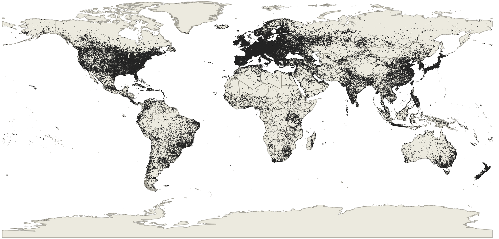

<div align="center">
  
  <br>
  <br>
</div>
<p align="center">
  <a href="https://huggingface.co/collections/allenai/olmoearth">
    
  </a>
</p>

The OlmoEarth models are a flexible, multi-modal, spatio-temporal family of foundation models for Earth Observations.

The OlmoEarth models exist as part of the [OlmoEarth platform](https://allenai.org/olmoearth). The OlmoEarth Platform is an end-to-end solution for scalable planetary intelligence, providing everything needed to go from raw data through R&D, to fine-tuning and production deployment.

## Installation

We recommend Python 3.12, and recommend using [uv](https://docs.astral.sh/uv/getting-started/installation/).
To install dependencies with uv, run:

```bash
git clone git@github.com:allenai/olmoearth_pretrain.git
cd olmoearth_pretrain
uv sync --locked --all-groups --python 3.12
# only necessary for development
uv tool install pre-commit --with pre-commit-uv --force-reinstall
```

uv installs everything into a venv, so to keep using python commands you can activate uv's venv: `source .venv/bin/activate`. Otherwise, swap to `uv run python`.

OlmoEarth is built using [OLMo-core](https://github.com/allenai/OLMo-core.git). OLMo-core's published [Docker images](https://github.com/orgs/allenai/packages?repo_name=OLMo-core) contain all core and optional dependencies.

## Model Summary

The OlmoEarth models are trained on three satellite modalities (Sentinel 2, Sentinel 1 and Landsat) and six derived maps (OpenStreetMap, WorldCover).
| Model Size | Weights | Encoder Params | Decoder Params |
| --- | --- | --- | --- |
| Nano | [link](https://huggingface.co/allenai/OlmoEarth-v1-Nano) | 1.4M | 800K |
| Tiny | [link](https://huggingface.co/allenai/OlmoEarth-v1-Tiny) | 6.2M | 1.9M |
| Base | [link](https://huggingface.co/allenai/OlmoEarth-v1-Base) | 89M | 30M |

## Data Summary

Our pretraining dataset contains around 300,000 samples from around the world of 2.56km×2.56km regions, although many samples contain only a subset of the timesteps and modalities.

The distribution of the samples is available below:



The dataset can be downloaded [here](https://huggingface.co/datasets/allenai/olmoearth_pretrain_dataset).

## Training scripts

Detailed instructions on how to pretrain your own OlmoEarth model are available in [Pretraining.md](docs/Pretraining.md).

## Evaluations

Detailed instructions on how to replicate our evaluations is available in #TODO.

## Deploying OlmoEarth

The OlmoEarth models exist as part of the [OlmoEarth platform](https://allenai.org/olmoearth). The OlmoEarth Platform is an end-to-end solution for scalable planetary intelligence, providing everything needed to go from raw data through R&D, to fine-tuning and production deployment.

Examples of active OlmoEarth deployments are available at [`olmoearth_projects`](github.com/allenai/olmoearth_projects).
